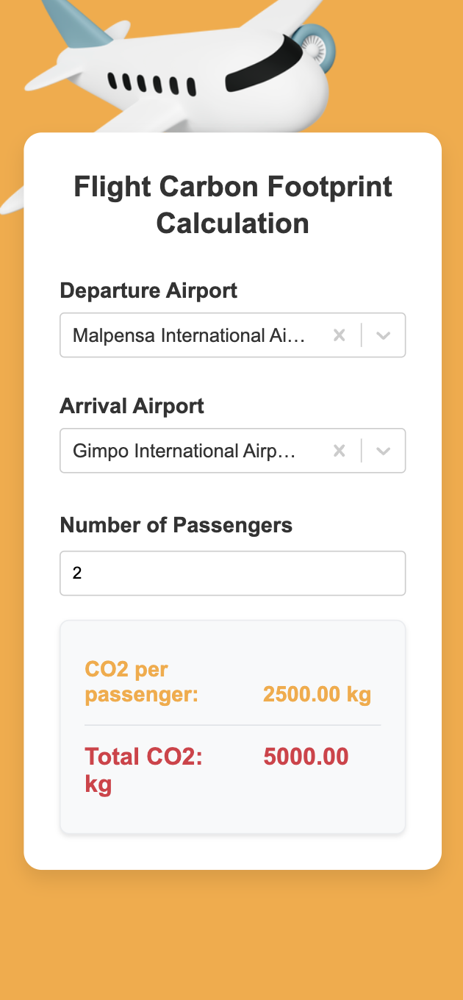
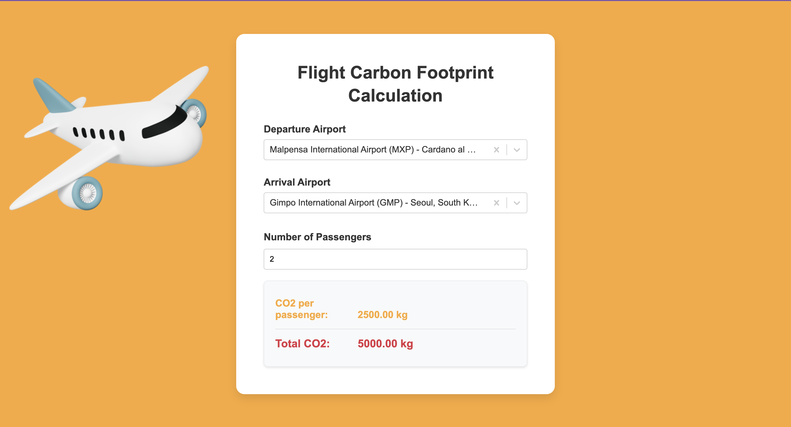

# Eco Flight

## Overview

This React-based web application allows users to calculate the carbon footprint of their flights. Users can select departure and arrival airports, specify the number of passengers, and receive an estimate of CO2 emissions per passenger and in total for the flight.

Live site: [Eco Flight](https://eco-flight.netlify.app/)

## Screenshots

<p>


</p>

## Features

- Airport selection for departure and arrival
- Passenger count selection
- Real-time CO2 emission calculation
- User-friendly interface

## Technologies Used

- React
- TypeScript
- CSS

## Getting Started

### Prerequisites

- Node.js (version 12 or higher)
- npm (usually comes with Node.js)

### Installation

1. Clone the repository:
   ```
   git clone https://github.com/your-username/flight-carbon-footprint-calculator.git
   ```

2. Navigate to the project directory:
   ```
   cd flight-carbon-footprint-calculator
   ```

3. Install dependencies:
   ```
   npm install
   ```

4. Start the development server:
   ```
   npm start
   ```

5. Open your browser and visit `http://localhost:3000` to view the application.

## Usage

1. Select a departure airport from the dropdown or by typing.
2. Select an arrival airport from the dropdown or by typing.
3. Adjust the number of passengers using the passenger selector.
4. View the calculated CO2 emissions per passenger and total for the flight.

## Project Structure

- `src/App.tsx`: Main component containing the application logic
- `src/components/`: Directory containing reusable components
  - `airportselector/`: Airport selection component
  - `passengerselector/`: Passenger count selection component
  - `result/`: Component for displaying CO2 emission results
- `src/repository/`: Directory containing data fetching and calculation functions
- `src/models/`: Directory containing TypeScript interfaces and types


